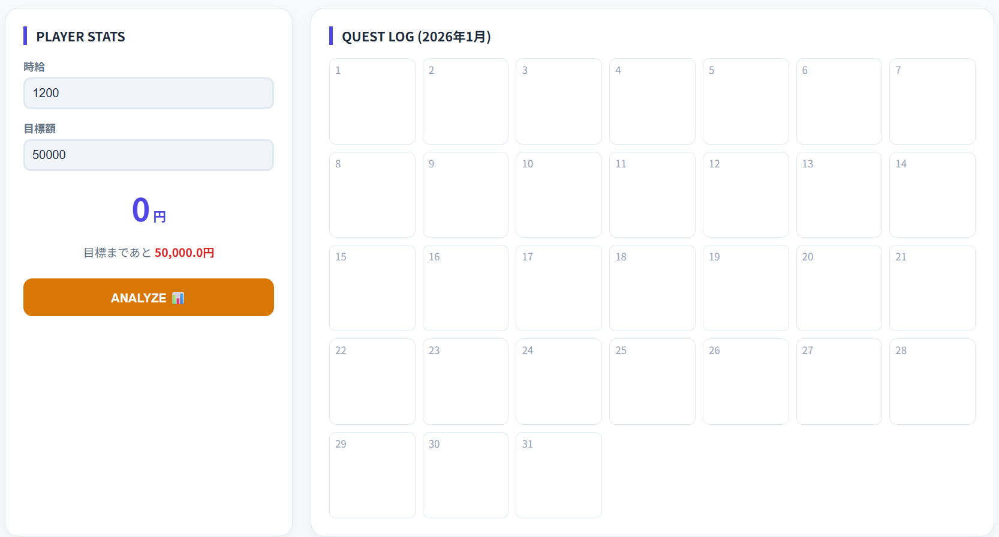
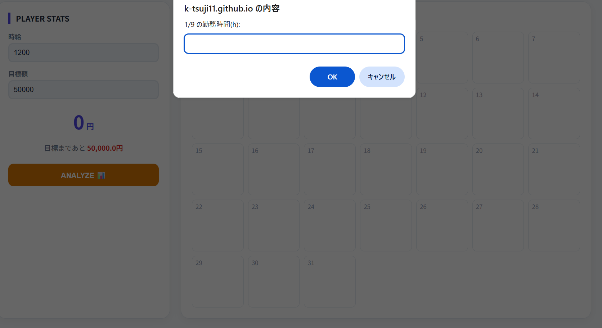
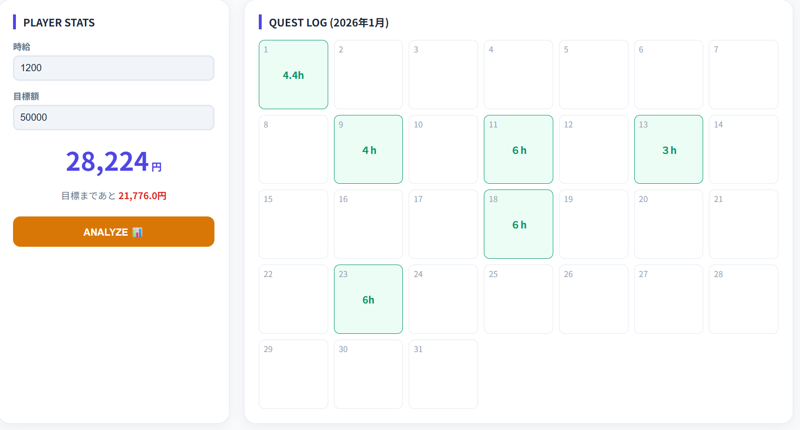
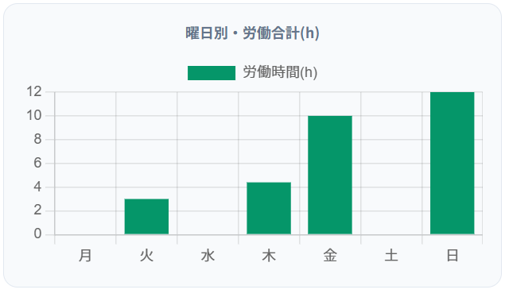
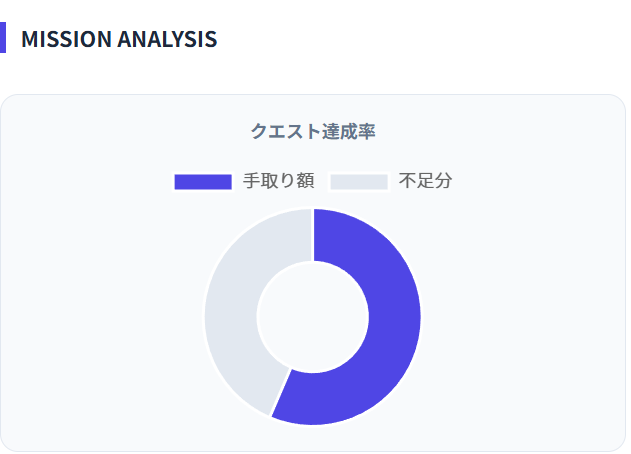

# 💰 バイト給料計算アプリ

「今月のバイト代、結局いくらになるの？」をパッと解決するアプリです！
手計算だと面倒な深夜手当や交通費も、これを使えば一瞬でわかります。

## 製作期間
* 2025年12月～2026年1月

## 🌈 このアプリでできること
* **入れるだけで計算**: 時給と働いた時間を入れるだけで、合計金額を自動で出します。
* **スマホでサクッと**: 外出先でもシフトが終わった後にすぐ入力できるように作りました。
* **目標まであと少し！**: 稼いだ金額が見えるので、やる気アップにつながります。

## 🚀 使い方

| 1. アプリを起動 | 2. カレンダー入力 | 3. 給料の確認 |
| :---: | :---: | :---: |
|  |  |  |
| まずはURLにアクセス | 日ごとのシフトを入力 | 自動で合計を算出 |

| 4. 傾向の分析 | 5. 目標達成度 |
| :---: | :---: |
|  |  |
| 曜日ごとの偏りを確認 | あといくら必要か表示 |

1. [こちらをクリックしてアプリを開く](https://k-tsuji11.github.io/app/)
2. カレンダーに時給や時間を入力する
3. 計算する
4. 曜日傾向や目標給料までの時間を確認できる

## 🛠 使ったもの
* **HTML**: 見やすくてシンプルなデザインにこだわりました。
* **Python**: 計算のロジックはこれで作っています。

## 💬 ひとこと
自分で使ってみて「これ便利だな」と思えるように工夫しました。
計算ボタンを押すと音がなるところも工夫した点なので、よかったら音を出してみてください！

